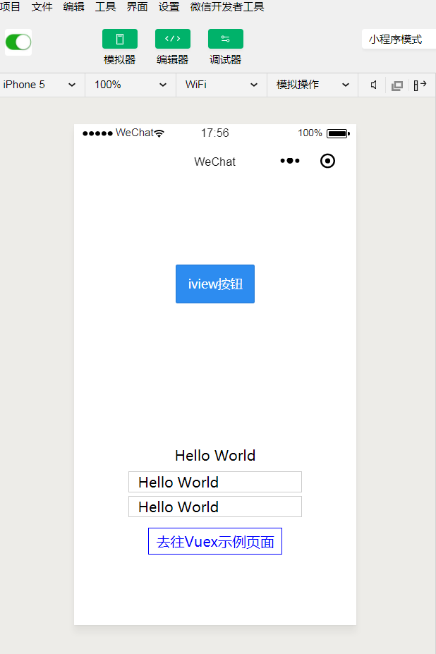

# mpvue-iview

mpvue结合iview 微信小程序ui组件的demo

## Build Setup

- 1.全局安装 vue-cli
  ```
  npm( or cnpm) install --global vue-cli@2.9
  ```
- 2.创建项目,新手一路回车选择默认就可以了
  ```
  vue init mpvue/mpvue-quickstart mpvue-demo
  ```
- 3.下载ivew weapp
  ```
  git clone https://github.com/TalkingData/iview-weapp.git
  ```
- 4.拷贝iview-weapp/dist目录到mpvue-demo/static/下
- 5.在mpvue-demo中引入iview组件:更改app.json，添加如下内容:
  ```
  "usingComponents": {
  "i-cell-group": "/static/iview/cell-group/index",
  "i-cell": "/static/iview/cell/index",
  "i-icon": "/static/iview/icon/index",
  "i-grid": "/static/iview/grid/index",
  "i-grid-item": "/static/iview/grid-item/index",
  "i-card": "/static/iview/card/index",
  "i-row": "/static/iview/row/index",
  "i-col": "/static/iview/col/index",
  "i-panel": "/static/iview/panel/index",
  "i-button": "/static/iview/button/index",
  "i-switch": "/static/iview/switch/index",
  "i-grid-icon": "/static/iview/grid-icon/index",
  "i-grid-label": "/static/iview/grid-label/index",
  "i-action-sheet": "/static/iview/action-sheet/index",
  "i-message": "/static/iview/message/index",
  "i-alert": "/static/iview/alert/index",
  "i-avatar": "/static/iview/avatar/index",
  "i-badge": "/static/iview/badge/index",
  "i-checkbox-group": "/static/iview/checkbox-group/index",
  "i-checkbox": "/static/iview/checkbox/index",
  "i-drawer": "/static/iview/drawer/index",
  "i-input": "/static/iview/input/index",
  "i-input-number": "/static/iview/input-number/index",
  "i-modal": "/static/iview/modal/index",
  "i-notice-bar": "/static/iview/notice-bar/index",
  "i-page": "/static/iview/page/index",
  "i-progress": "/static/iview/progress/index",
  "i-radio-group": "/static/iview/radio-group/index",
  "i-radio": "/static/iview/radio/index",
  "i-rate": "/static/iview/rate/index",
  "i-spin": "/static/iview/spin/index",
  "i-steps": "/static/iview/steps/index",
  "i-step": "/static/iview/step/index",
  "i-tab-bar": "/static/iview/tab-bar/index",
  "i-tab-bar-item": "/static/iview/tab-bar-item/index",
  "i-tabs": "/static/iview/tabs/index",
  "i-tab": "/static/iview/tab/index",
  "i-tag": "/static/iview/tag/index",
  "i-toast": "/static/iview/toast/index",
  "i-swipeout": "/static/iview/swipeout/index",
  "i-count-down": "/static/iview/count-down/index",
  "i-divider": "/static/iview/divider/index",
  "i-index": "/static/iview/index/index",
  "i-index-item": "/static/iview/index-item/index",
  "i-collapse": "/static/iview/collapse/index",
  "i-collapse-item": "/static/iview/collapse-item/index",
  "i-sticky": "/static/iview/sticky/index",
  "i-sticky-item": "/static/iview/sticky-item/index",
  "i-load-more": "/static/iview/load-more/index"
  }
  ```
- 6.在项目中使用iview组件,在pages/index/index.vue中添加如下内容:
  ```
    <i-button type="primary">ivew按钮</i-button>
  ```
- 6. mpvue-demo安装依赖
    ```
   cd mpvue-demo
   npm install
   npm run dev
   ```
- 7.在微信开发工具中新建小程序项目，目录选择mpvue-demo/dist/wx,



**注意** 上述过程iview组件的样式可能会失效，这个时候可以尝试重新运行npm run dev以及重新打开微信开发工具来解决。
